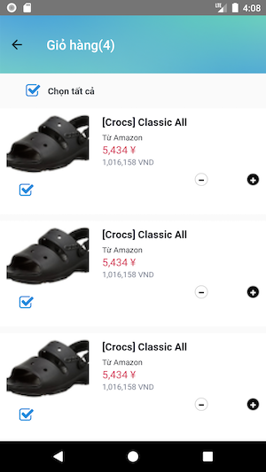

# 🛒 E-Commerce Mobile App

A cross-platform mobile e-commerce application built with **React Native**, powered by a custom backend API developed in **PHP**. Users can browse products, manage their cart, and place orders through a modern and responsive interface.

---

## 🚀 Features

- 📦 Product listing and details view
- 🛒 Cart management and checkout flow
- 🔐 User authentication (Login/Register)
- 💳 Order processing and history
- 📲 Smooth and responsive mobile UI
- 🔧 Admin API endpoints for product and order management

---

## 📸 Screenshots

> Add screenshots in the `images/` folder and reference them here.




---

## 🧑‍💻 Tech Stack

**Frontend: (Mobile App)**  
- React Native (Expo or bare)
- Redux / Context API (for state)
- Axios (API requests)
- React Navigation

**Backend: (API)**  
- PHP (Core or with a micro framework like Slim or Lumen)
- MySQL (or other relational DB)
- JWT for authentication
- RESTful API architecture

---

## 🛠️ Getting Started

### 📱 Mobile App (React Native)

1. Clone the repo:
   ```bash
   git clone https://github.com/yourusername/ecommerce-app.git
   cd ecommerce-app

